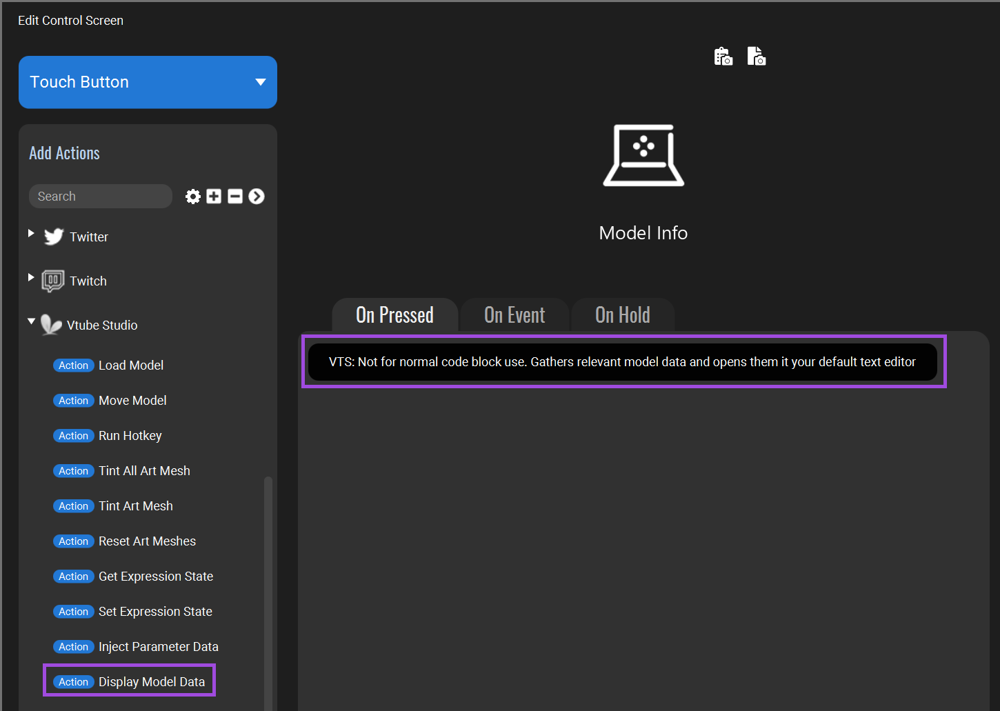

**NOTE:** This is a work in progress and is far from complete.

This tutorial will walk you through using the [TP_VTS](https://wiccy.itch.io/tp-vts) plugin with [Touch Portal](https://www.touch-portal.com/) to control [VTube Studio](https://denchisoft.com/).
This combination is like having a steam deck, but it only costs $13.99 US for Touch Portal Pro and however much you donate to the TP_VTS plugin.
Much less than what it costs to buy even the smallest Stream Deck.

<!--more-->

## Introduction

[TP_VTS](https://wiccy.itch.io/tp-vts) is a plugin for [Touch Portal](https://www.touch-portal.com/) that interacts with [VTube Studio](https://denchisoft.com/).
The TP_VTS plugin is donation ware and has a recommended donation of $2.00 US.
Considering how much the TP_VTS plugin can do please consider donating more.
This plugin allows you to:

* Load a model, move a model and display a models data (Location, scale, rotation...).
* Run hotkeys. The hotkeys don't even need a key sequence, they are activated directly in VTube Studio.
* Get and set expression states. This can set an expression without a hotkey.
  You can also use this to set the state of multiple expressions at once.
* And much more, which I haven't made use of yet.

[Touch Portal](https://www.touch-portal.com/) is a very useful tool.
Functionally it is like a Stream Deck, except it runs on Android and Apple mobile devices.
Android back to 5.1 and IOS back to 9.3 are supported, so you can make use of your old devices.
To use plugins with Touch Portal you need to pau $13.99 US to upgrade to Pro.
Out of the box Touch Portal can also interact with [OBS](https://obsproject.com/), [Streamlabs Desktop](https://streamlabs.com/) and [Twitch](https://www.twitch.tv/).
Giving you complete control over your streaming setup.

[VTube Studio](https://denchisoft.com/) is software for Virtual YouTubers "VTubers" that animates a mode.
Many VTubers use this software, including myself.

## Preparation

From here on it is assumed you have:

* [Touch Portal](https://www.touch-portal.com/) installed and setup.
  See the [Getting started with Touch Portal](https://www.touch-portal.com/blog/post/tutorials/get_started_with_touch_portal.php) page for help.
* The app installed on an Android or Apple device and upgraded to Pro.
  Pro is required to use plugins, and you have to do the upgrade on the mobile device.
* [TP_VTS](https://wiccy.itch.io/tp-vts) plugin installed in Touch Portal.
  See the [TP_VTS Wiki](https://wiccy.net/TP_VTS/doku.php) for help.
* [VTube Studio](https://denchisoft.com/) installed and configured with Plugins enabled.
  See the [VTube Studio Manual/Wiki](https://github.com/DenchiSoft/VTubeStudio/wiki) for help.

## Touch Portal Quirks

Some quirks of Touch Portal that you should be aware of.

* If you set full screen mode it can be difficult to get back out.
  Simple tap the screen twice using two fingers.

* Sometimes the PC application and the mobile application will get out of sync.
  When this happens updates made on the PC will not be reflected on the mobile device.
  Sometimes this is caused by the two applications becoming disconnected.
  Other times the two applications are still communicating, but updates are not reflected.
  This situation can be resolved by restarting both applications.

## Basic configurations

This section covers basic usage of the TP_VTS plugin.

### Running a hotkey

The TP_VTS plugin action `Run Hotkey` will run any Hotkey in VTube Studio.
The Hotkeys do not need to have a key sequence assigned in order for them to be used.

To select a hotkey add the action `Run Hotkey` then use the `+` button to select the hotkey.
Note that you can select anything in the menu, but only hotkeys will work.


### Set an expression state

The TP_VTS plugin action `Set Expression State` will set the state of an expression to `On` or `Off`.
Unlike using a Hotkey which will toggle an expression, this action will directly set the state of the expression.
I use this for turning my models tail on and off.

To select a hotkey add the action `Set Expression State`, use the `+` button to select the expression then select the state to `On` or `Off`.
Note that you can select anything in the menu, but only expressions will work.


### Getting model data

The TP_VTS plugin action `Display Model Data` is extremely useful for moving your model.
This action writes all of the model data to a text file and then opens the text file.
Most useful is the model location information, which can be used with the action `Move Model`.

The action takes no parameters so it can simply be added to a button.
Note that the action displays the text `VTS: Not for normal code block use. ...` when used in a button.



Here is an example of the data this action will gather.
There is much more data in this file.
The `Model Location` is what this tutorial is concerned with.

```text
Here you will find data requested for the currently loaded model

Model Name: customizable final
Model ID: 92909a752c3a4a5daec15bb4e7ab0e80

Model Location:
    X = -0.6552083492279053
    Y = -2.220370292663574
    Rotation = 360.0
    Size = 4.857949256896973

Hotkeys:
    Type: ToggleExpression
        Name: Angry
          ID: 4a8c61d9819441368c2e32c561536048
...
```

### Moving the model

TO BE COMPLETED

## More complicated configurations

More complicated buttons to control VTube Studio.

### Combining actions

TO BE COMPLETED

### Getting the state of an expression

TO BE COMPLETED

### Creating Twitch events

TO BE COMPLETED

## Bonus: Creating custom Touch Portal Icons

Touch Portal allows you to use an image for buttons.
This lets you do things like create a button that shows the expression you are toggling.

Touch Portal wants images to be 256x256 pixels and in either JPEG, PNG or GIF formats.

TO BE COMPLETED
